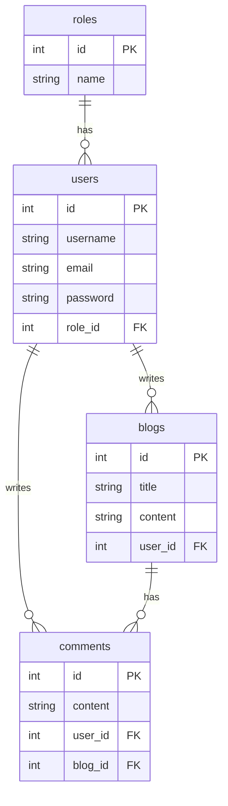

# Understanding Search Indexing Engines: A Didactic Tutorial & Guide with PHP and Meilisearch

Welcome to this educational repository! This project serves as a hands-on sandbox and learning tutorial designed to explain the fundamental differences between **Relational Databases (SQL)** and **Search/Indexing Engines (NoSQL/Information Retrieval)** using a custom PHP MVC application and **Meilisearch**.

This guide will introduce you to search engine concepts, show you how this repository is structured, and walk you through the codebase to demonstrate how indexing, denormalization, and search queries work in practice.

---

## Table of Contents
1. [Core Concepts: Relational Databases vs. Search Engines](#1-core-concepts-relational-databases-vs-search-engines)
   - [Why RDBMS Struggles with Search](#why-rdbms-struggles-with-search)
   - [What is a Search Indexing Engine?](#what-is-a-search-indexing-engine)
   - [The Inverted Index](#the-inverted-index)
2. [Repository Architecture](#2-repository-architecture)
   - [Database Schema (MySQL)](#database-schema-mysql)
   - [MVC Directory Structure](#mvc-directory-structure)
   - [Dual-Search Flow](#dual-search-flow)
3. [Step-by-Step Didactic Tutorial](#3-step-by-step-didactic-tutorial)
   - [Step 1: Database Setup & Seeding](#step-1-database-setup--seeding)
   - [Step 2: Relational Querying (Flat SQL Joins)](#step-2-relational-querying-flat-sql-joins)
   - [Step 3: Document Modeling & Indexing (Denormalization)](#step-3-document-modeling--indexing-denormalization)
   - [Step 4: Active Record Sync & Eventual Consistency](#step-4-active-record-sync--eventual-consistency)
   - [Step 5: Querying Meilisearch (Instant Search)](#step-5-querying-meilisearch-instant-search)
4. [SQL vs. Meilisearch Comparison](#4-sql-vs-meilisearch-comparison)
5. [Getting Started (Run it Locally)](#5-getting-started-run-it-locally)

---

## 1. Core Concepts: Relational Databases vs. Search Engines

### Why RDBMS Struggles with Search
Relational Database Management Systems (RDBMS) like MySQL or PostgreSQL are optimized for **transactional consistency** (ACID compliance) and normalized relationships. However, when it comes to full-text search, they face severe limitations:
* **The Wildcard Problem**: Performing a wildcard search like `LIKE '%query%'` forces the database to perform a **Full Table Scan**. It must read every single row in the database, rendering indexes useless and making queries extremely slow as the database grows.
* **No Typo Tolerance**: Relational databases match characters exactly. If a user searches for `"computr"` instead of `"computer"`, standard SQL queries yield zero results.
* **No Relevance Ranking**: SQL queries return results matching a boolean filter, but they do not naturally order results by how "relevant" they are to the search query.
* **High Join Complexity**: Fetching a blog post with its author, user roles, and comments requires joining multiple tables. Running full-text queries across these joins multiplies the CPU overhead.

### What is a Search Indexing Engine?
A Search Engine (like Meilisearch, Elasticsearch, or Algolia) is an **Information Retrieval (IR)** system. It does not replace your primary database; instead, it runs alongside it. You feed it **JSON documents** (denormalized packets of data), which it processes, analyzes, and indexes to allow sub-millisecond search retrieval.

### The Inverted Index
At the heart of any search engine is the **Inverted Index**. Instead of mapping a document to the words it contains (like a book mapping pages to text), an inverted index maps **words** to the **documents** they appear in.

#### Traditional Database (Forward Index)
| Document ID | Content |
|---|---|
| Doc 1 | "I love indexing databases" |
| Doc 2 | "Search engines are fast" |
| Doc 3 | "I love fast search" |

#### Inverted Index
| Term | Appears in Document IDs |
|---|---|
| I | Doc 1, Doc 3 |
| love | Doc 1, Doc 3 |
| indexing | Doc 1 |
| databases | Doc 1 |
| Search | Doc 2, Doc 3 |
| engines | Doc 2 |
| are | Doc 2 |
| fast | Doc 2, Doc 3 |

When you search for `"fast search"`, Meilisearch looks up the terms `"fast"` and `"search"` in the inverted index, intersects the document sets (`{Doc 2, Doc 3}` and `{Doc 2, Doc 3}`), and instantly returns the match.

---

## 2. Repository Architecture

This repository contains a lightweight, custom-built PHP MVC application that connects to a **MySQL** database (for primary storage) and a **Meilisearch** instance (for search indexing).

### Database Schema (MySQL)
The relational database is normalized into four tables:


### MVC Directory Structure
Here is where the key code resides:
* [index.php](file:///wsl.localhost/Ubuntu/home/fenner/apps/meilisearch-blog/index.php): Entry point of the web app. Boots the router and forwards HTTP requests.
* [routes.php](file:///wsl.localhost/Ubuntu/home/fenner/apps/meilisearch-blog/routes.php): Defines path mapping (e.g. `/` goes to SQL-based search, `/indexbysearch` goes to Meilisearch).
* [src/Setup/](file:///wsl.localhost/Ubuntu/home/fenner/apps/meilisearch-blog/src/Setup/): Contains database connection settings ([Database.php](file:///wsl.localhost/Ubuntu/home/fenner/apps/meilisearch-blog/src/Setup/Database.php)), table creation schema ([DatabaseSetup.php](file:///wsl.localhost/Ubuntu/home/fenner/apps/meilisearch-blog/src/Setup/DatabaseSetup.php)), and seed generator ([DatabaseSeeder.php](file:///wsl.localhost/Ubuntu/home/fenner/apps/meilisearch-blog/src/Setup/DatabaseSeeder.php)).
* [src/Models/](file:///wsl.localhost/Ubuntu/home/fenner/apps/meilisearch-blog/src/Models/): Contain SQL interactions.
  - [Model.php](file:///wsl.localhost/Ubuntu/home/fenner/apps/meilisearch-blog/src/Models/Model.php): Base Active-Record class that synchronizes changes to Meilisearch.
  - [Blog.php](file:///wsl.localhost/Ubuntu/home/fenner/apps/meilisearch-blog/src/Models/Blog.php): Deals with blog queries and formats nested structures for indexing.
* [src/Services/GlobalSearch.php](file:///wsl.localhost/Ubuntu/home/fenner/apps/meilisearch-blog/src/Services/GlobalSearch.php): Encapsulates interactions with Meilisearch (searching, offset-pagination, filtering, configuration settings).
* [src/Controllers/BlogController.php](file:///wsl.localhost/Ubuntu/home/fenner/apps/meilisearch-blog/src/Controllers/BlogController.php): Controls the business logic, measures execution speed, and returns JSON responses.

### Dual-Search Flow
The application showcases two different paths to retrieve data:

```mermaid
graph TD
    A[Client Request] --> B{Route URL}
    B -- "/" --> C[BlogController@index]
    C --> D[MySQL Database]
    D -->|Flat SQL Join Query| E[Return Flat Array]
    E --> F[Client Response with Execution Time]

    B -- "/indexbysearch" --> G[BlogController@indexBySearch]
    G --> H[GlobalSearch Service]
    H --> I[Meilisearch Server]
    I -->|Instant Inverted Index Search| J[Return Nested JSON Docs]
    J --> F
```

---

## 3. Step-by-Step Didactic Tutorial

Let's dissect the code step-by-step to understand how indexing works.

### Step 1: Database Setup & Seeding
To demonstrate performance under load, the [DatabaseSeeder.php](file:///wsl.localhost/Ubuntu/home/fenner/apps/meilisearch-blog/src/Setup/DatabaseSeeder.php) script inserts:
* **3 users** with roles.
* **10,000 blog posts**.
* **15,000 comments** distributed randomly across the first 50 blogs.

When you run `php setup.php`, it executes the SQL statements and populates the database.

### Step 2: Relational Querying (Flat SQL Joins)
In a traditional setup, fetching all details of a blog (including the author, their role, and all associated comments) requires a multi-table `LEFT JOIN`. 

Look at `getAllBlogsWithCommentsAndUserRoles()` inside [src/Models/Blog.php](file:///wsl.localhost/Ubuntu/home/fenner/apps/meilisearch-blog/src/Models/Blog.php#L22-L43):
```sql
SELECT 
    blogs.id AS id, 
    blogs.title AS blog_title, 
    blogs.content AS blog_content, 
    users.id AS user_id, 
    users.username AS user_username, 
    users.email AS user_email, 
    roles.name AS user_role,
    comments.id AS comment_id,
    comments.content AS comment_content
FROM blogs
LEFT JOIN users ON blogs.user_id = users.id
LEFT JOIN roles ON users.role_id = roles.id
LEFT JOIN comments ON blogs.id = comments.blog_id
```
#### The Problem with SQL Joins for Search APIs:
1. **Data Redundancy**: If a blog has 20 comments, this query will return **20 rows** for that blog. The blog title, body, and user author details are repeated identically in all 20 rows, bloating the response size and payload.
2. **Flattened Structure**: The database returns a flat array of key-value pairs, which the application must parse and manually group to construct a proper nested hierarchical tree (e.g., nesting comments under a blog object).

### Step 3: Document Modeling & Indexing (Denormalization)
To search efficiently, we **denormalize** this data. Instead of keeping tables separated, we combine them into a single structured representation (a document) and store it inside Meilisearch.

Look at how `indexBlogs()` inside [src/Models/Blog.php](file:///wsl.localhost/Ubuntu/home/fenner/apps/meilisearch-blog/src/Models/Blog.php#L51-L73) achieves this:
```php
public function indexBlogs() {
    $blogs = $this->getAllBlogsWithCommentsAndUserRoles();
    $documents = [];
    foreach ($blogs as $blog) {
        // Group flat SQL join rows by Blog ID into a nested JSON structure
        $documents[$blog['id']]['id'] = $blog['id'];
        $documents[$blog['id']]['blog_title'] = $blog['blog_title'];
        $documents[$blog['id']]['blog_content'] = $blog['blog_content'];
        $documents[$blog['id']]['user'] = [
            'user_id' => $blog['user_id'],
            'user_username' => $blog['user_username'],
            'user_email' => $blog['user_email'],
            'user_role' => $blog['user_role'],
        ];
        // Append comments dynamically as an array of child objects
        $documents[$blog['id']]['comments'][] = [
            'comment_id' => $blog['comment_id'],
            'comment_content' => $blog['comment_content'],
        ];
    }

    $documents = array_values($documents);
    $index = $this->meiliSearch->getIndex('blogs');
    $index->addDocuments($documents, 'id'); // Send denormalized documents to Meilisearch
}
```

This transforms the flat SQL result into clean, standalone JSON documents resembling this:
```json
{
  "id": 1,
  "blog_title": "Blog Post 1",
  "blog_content": "This is the content of blog post number 1.",
  "user": {
    "user_id": 2,
    "user_username": "user1",
    "user_email": "user1@example.com",
    "user_role": "User"
  },
  "comments": [
    { "comment_id": 5, "comment_content": "Comment number 5" },
    { "comment_id": 12, "comment_content": "Comment number 12" }
  ]
}
```

### Step 4: Active Record Sync & Eventual Consistency
A key challenge with search engines is **keeping the index in sync** with the primary SQL database. When a database record changes, the search index must update.

This repo implements an automated synchronization hook in the base [Model.php](file:///wsl.localhost/Ubuntu/home/fenner/apps/meilisearch-blog/src/Models/Model.php#L18-L54):
```php
public function create($table, $data) {
    // 1. Insert into MySQL
    ...
    $id = $this->db->lastInsertId();
    // 2. Trigger Meilisearch indexing hook
    $this->indexRecord($id);
    return $id;
}

public function update($table, $data, $id) {
    // 1. Update in MySQL
    ...
    // 2. Trigger Meilisearch indexing hook
    $this->indexRecord($id);
}

protected function indexRecord($id) {
    // Fetch newly updated record from MySQL
    $stmt = $this->db->prepare("SELECT * FROM {$this->indexName} WHERE id = :id");
    $stmt->execute(['id' => $id]);
    $record = $stmt->fetch(PDO::FETCH_ASSOC);

    if ($record) {
        $index = $this->meiliSearch->getIndex($this->indexName);
        // Push the update to Meilisearch. Meilisearch is upsert-based: 
        // if the document with this ID already exists, it is updated; otherwise, it is created.
        $index->addDocuments([$record]);
    }
}
```

> [!NOTE]
> This represents **Eventual Consistency**. While MySQL completes the transaction immediately, Meilisearch queues the document addition task and processes it asynchronously, meaning the search results reflect changes a few milliseconds later.

### Step 5: Querying Meilisearch (Instant Search)
When searching, we bypass MySQL entirely and talk directly to Meilisearch using [src/Services/GlobalSearch.php](file:///wsl.localhost/Ubuntu/home/fenner/apps/meilisearch-blog/src/Services/GlobalSearch.php#L23-L43):

```php
public function getAllDocumentsFromIndex($indexName, $query, $perPage = 20, $page = 1)
{
    $offset = ($page - 1) * $perPage;
    
    // Search the index
    $results = $this->meiliSearch->index($indexName)->search($query, [
        'limit' => $perPage,
        'offset' => $offset
    ]);
    
    $hits = $results->getHits();

    // Adjust settings dynamically (e.g. maximum allowed hits)
    $this->meiliSearch->index($indexName)->updateSettings([
        'pagination' => [
            'maxTotalHits' => 500
        ]
    ]);
    
    $settings = $this->meiliSearch->index($indexName)->getSettings();

    return [
        'hits' => $hits,
        'settings' => $settings
    ];
}
```

* **Typo Tolerance**: If you query for `"Bllog"`, Meilisearch automatically maps it to `"Blog"` using Levenshtein distance calculations behind the scenes.
* **Pagination**: Done quickly using `$offset` and `$limit` without counting millions of rows in MySQL.

---

## 4. SQL vs. Meilisearch Comparison

| Feature | Relational Database (SQL) | Search Indexing Engine (Meilisearch) |
| :--- | :--- | :--- |
| **Primary Use-case** | Source of truth, ACID transactions, relational integrity | High-speed search retrieval, analytics, text mining |
| **Data Schema** | Highly normalized (tables, foreign keys) | Denormalized (Nested JSON documents) |
| **Search Speed** | Slows down exponentially with joins and full-text scans | Sub-millisecond speeds, constant response time |
| **Typo Tolerance** | None out of the box (requires complex, slow soundex / levenshtein SQL procedures) | Native (Levenshtein distance algorithm configured by default) |
| **Relevance Ranking** | Binary match (row matches or doesn't match; sorting is manual) | Custom ranking rules (e.g. proximity, attributes, typo count) |
| **Query Style** | Structured query language (SQL SELECTs) | Text-based search queries via REST API / SDK |

---

## 5. Getting Started (Run it Locally)

Follow these steps to run the repository on your local machine and see the performance difference for yourself.

### Prerequisites
* PHP 8.1+ with `curl` and `pdo` extensions active.
* MySQL Server.
* Composer (PHP package manager).
* [Meilisearch Server](https://docs.meilisearch.com/learn/getting_started/quick_start.html) running locally on port `7700`.

### Setup Instructions

1. **Install Composer Dependencies**
   Run the following command in the project directory to install the Meilisearch PHP client and Guzzle HTTP adapters:
   ```bash
   composer install
   ```

2. **Configure Database Credentials**
   Open [src/Setup/Database.php](file:///wsl.localhost/Ubuntu/home/fenner/apps/meilisearch-blog/src/Setup/Database.php#L11-L15) and update the DSN host, database name, username, and password to match your local MySQL configuration:
   ```php
   $dsn = "mysql:host=127.0.0.1;dbname=blog;charset=utf8mb4";
   $this->pdo = new PDO($dsn, 'your_username', 'your_password');
   ```

3. **Initialize Database Tables and Seeds**
   Execute the setup script to build the tables and seed 10,000 blog posts:
   ```bash
   php setup.php
   ```

4. **Index Documents into Meilisearch**
   Ensure your Meilisearch server is running on `http://localhost:7700`. In a shell or PHP scratch script, trigger the initial indexation by calling:
   ```php
   use Fenner\Blog\Models\Blog;
   $blogModel = new Blog();
   $blogModel->indexBlogs();
   ```

5. **Run the PHP Development Server**
   Start the local PHP server:
   ```bash
   php -S localhost:8000
   ```

6. **Test & Compare Endpoints**
   Open your browser or run API tests to check execution times (returned in the `execution_time` header):
   - **Relational Search (SQL Joins)**: [http://localhost:8000/](http://localhost:8000/)
   - **Meilisearch (Inverted Index Search)**: [http://localhost:8000/indexbysearch?search=Post&page=1](http://localhost:8000/indexbysearch?search=Post&page=1)
